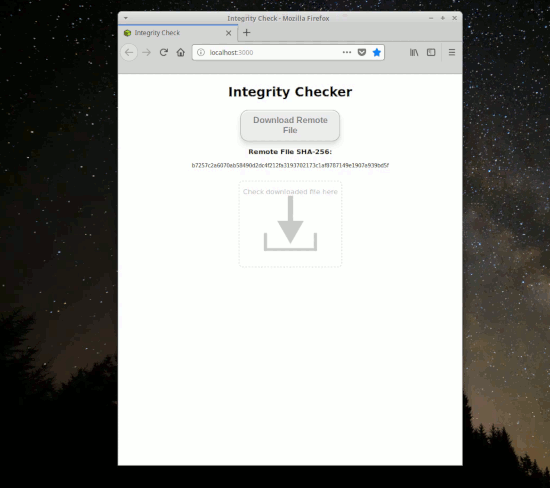

Name
----

react-drag-drop-info

Description
-----------

A Drag-n-Drop Box component that obtains information from files in a simple way. Especially useful for checking file integrity.


Installation
-----------

```bash
npm install react-drag-drop-info
```

Usage
-----

```javascript
const Box = require("react-drag-drop-info")

...

handleResponse(obj){
  console.log(obj);
}

...

<Box handleDrop={fn} boxId={id}/>
```

Examples
---------





You can see this example <a href="https://spa-sha256-d892f.firebaseapp.com/">in action here</a>.


Testing
-------

This project uses Jest for testing.
Visit https://jestjs.io/ for details.

To execute tests: 

```bash
npm test
```
